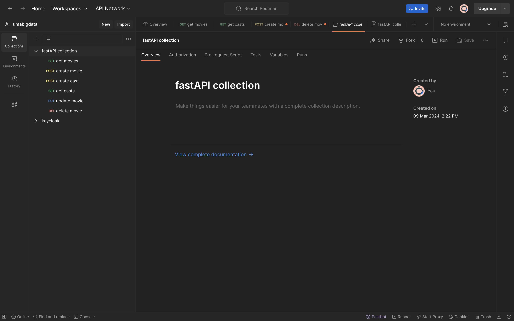

# Requeriments
* Dockers for running https://www.docker.com/products/docker-desktop/ 
* postman for testing https://www.postman.com/downloads/

# What´s on it
* cast-service microservice to handle the castof the movies
* cast-service-bd database for persistance of the data
* movie-service microservice to handle request 
* movie-service-bd database for persistence for the movies
* ngix-conf web server configuration and docker file for reverse proxy reverse proxy

## Data models
* movies
```
{
        "name": "Titanic",
        "plot": "big ass boat sinks",
        "genres": [
            "Action",
            "Adventure",
            "drama"
        ],
        "casts_id": [
            1
        ]
}
```
* cast
```
{
  "name": "Silvester Stallone",
  "nationality": "United States"
}
```
## How to run the project
On a terminal windows/command windows run the following:
on the root folder of the project

 docker-compose up -d
 
## postman project

click on "view documentation" to load more details
